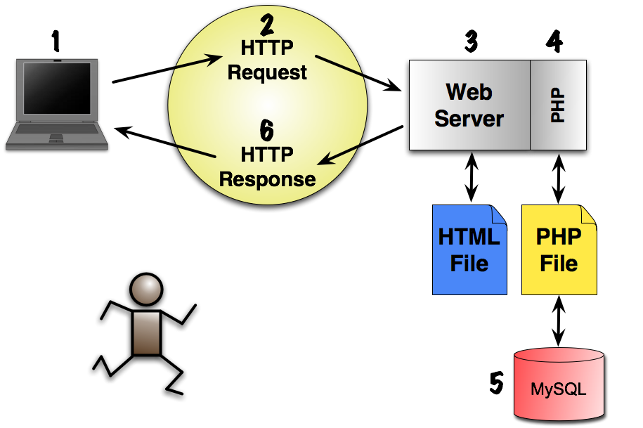

#Basic PHP Syntax and HTML Forms
##Week 3

---
##Agenda 
###Based on Quigley Chapters 2 & 4
- Getting Started with PHP
- Introduction to Data Types
- Using Variables and Constants
- Using HTML Forms and Form Variables

---
#Getting Started with PHP

---



^ 1. The user makes a request for a Web site by typing the address of the Web site in the browser's URL location box. The browser attempts to transmit the "request" to the server indicated by the URL using the HTTP protocol.

^ 2. The network can be a very large network such as the Internet, an intranet within an organization, or a wireless network on a personal desktop computer. The HTTP protocol is used to transfer documents to and from the server.

^ 3. Web servers are generic programs capable of accepting Web-based requests and providing the response to them. With dynamic Web sites, Web servers turn over the request for a specific file to an appropriate helper application.

^ 4. PHP is a module that resides within the Web server. The server opens the file (script) and reads it line by line. It hands over any PHP instructions to the PHP module for processing and replaces the PHP code with the output it generated back into the page.

^ 5. If the Web page consists of PHP with MySQL (or any other database) statements, then PHP may make further requests to the database to retrieve, send, or update information on the fly.

^ 6. The Web server responds to the browser's request. If the request just involves static HTML, this response is simply retrieving the file from server's local file system. A dynamic web site's response includes any output returned by modules such as the PHP module.

---
###The Anatomy of a PHP Script

A PHP script is a file (ending with a .php extension) consisting of text, HTML, and PHP instructions interspersed throughout the file. The PHP instructions are contained within two HTML style tags:

```<?php``` is the opening tag ```?>``` is the closing tag.

Everything between these two tags is interpreted by the PHP module (also called interpreter) and converted to regular text and HTML before being sent back to the requesting browser.

^ If, for example, one of the PHP instructions is to get today's date from the server, PHP will get the date and replace the PHP instruction with the current date. When the browser gets the file, it will not see the PHP tags or any of the PHP instructions; it will get only what PHP generated as a result of its processing.

---
###Example
What the PHP interpreter gets:
```
<?php
  echo "Hello, world.<br />";
?>
```
What the Web browser gets:

```Hello, world.```

---
###The Steps of Writing a PHP Script

- Because PHP is a scripting language designed to be integrated with other text documents, most commonly HTML, you will write your scripts in a text editor.
- Some popular text editors are BBEdit (Macintosh), Wordpad, Notepad (Windows), pico, vi, emacs (Linux/UNIX), and so on.
- Also available are third-party editors, such as jEdit, TextPad and WinEdit, as well as integrated development environments (IDEs) such as Dreamweaver and Eclipse.

---
###PHP Tags

- The script file may contain HTML, XHTML, XML, and so on, but PHP will consider the file as just plain text and leave it alone, unless you explicitly embed the PHP statements between its own special tags:
```
<?php
  statement;
  statement;
?>
```

---
###PHP Tags
- Each statement must be terminated with a semicolon (unless it is the last line of the script). If you forget the semicolon PHP will produce an error message similar to this:

```Parse error: syntax error, unexpected T_PRINT in c:\wamp\www\exemples\first.php on line 4```

---
###Additional PHP Tags
PHP supports three other types of tags, the full PHP tags are the most reliable, some servers may not support all. 

```
|Tags       |Description                                   |
|-----------|----------------------------------------------|
|PHP tags   | <?php phpinfo(); ?>                          |
|HTML style | <script language="php"> phpinfo(); </script> |
|ASP style  | <% php phpinfo(); %>                         |
|PHP short  | <?= php phpinfo(); ?>                        |
```

> Each are using the ```phpinfo()``` function as example code.

---
###Mixing in PHP
```
<html>
   <head><title>Mixing HTML and PHP</title></head>
   <body>
   <div class='main'>
     <h1>
      <?php 
        print "It's such a perfect day!"; 
      ?>
      </h1>
      <p>Some paragraph text.</p>
    </div>
   </body>
</html>
```
^ Here we're using php to generate the text for the header, this is a trivial example but imaging setting the header to be 'Welcome <username> to our great site' 

---
###Mixing in PHP - Bad
```
<html>
   <head><title>Mixing HTML and PHP</title></head>
   <body>
   <div class='main'>
      <?php 
        print "<h1>It's such a perfect day!</h1>"; 
      ?>
      <p>Some paragraph text.</p>
    </div>
   </body>
</html>
```
^ What is wrong with this code?

---
###Commenting your code
- We all write code for a reason, we may need at times to share why something is the way it is.
```
<?php
  //Single line comment
  # Also a single line comment
  phpinfo(); //comment after code
  /*
    Multi line block, you can add as many
    lines as you want, but don't write a book
  */
?>
```

---
###Functions
- A big part of any programming language is the set of functions that are built into the language or packaged in special libraries.

- Later in the course you will learn how create your own functions, but for now, we concentrate on the "built-in" functions that are part of the PHP language.

---
###What is a function?
> 'A block of statements that can be used repeatedly in a program' - w3schools.com

---
###What is a function?

---
